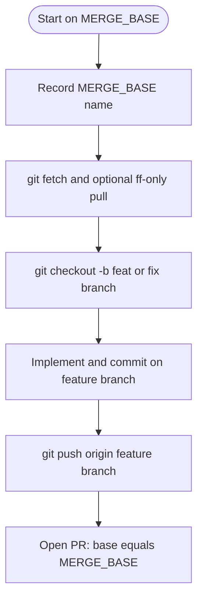

# Feature branch from **current** branch → PR back to **same** branch

Use this skill when **all** of the following are true:

- The user (or you) are **already** on the branch that should receive the merge — e.g. **`dev-new-kuberly`**, **`dev`**, **`main`** — not on a throwaway local branch unless they said that branch is the merge target.
- The task **changes the repo** (IaC, scripts, docs, hooks) and should ship via **review**, not by committing directly on that long-lived branch without being asked.
- The PR must include a **clear narrative**, **Mermaid** diagrams (at least the **git/branch lifecycle**), and pointers to **tests / plans** where applicable.

Pair with **`git-pr-templates`** (`references/infra-fork-pr.md`) for section headings, and with **`infra-change-git-pr-workflow`** for OpenSpec, plan-only, and ticket hygiene — **this** skill only tightens **which branch is the base**: **the active branch at task start**.

## Non‑negotiables

**Agents:** do not modify repository files (patch/write/delete on tracked paths) until step **3** is complete. If you already edited on **`MERGE_BASE`**, stash, create the feature branch, then re-apply — never leave the only copy of work committed only on the integration branch when a PR is expected.

1. **Record the merge base before creating a feature branch**

   ```bash
   git fetch origin
   MERGE_BASE="$(git branch --show-current)"
   ```

   If **`MERGE_BASE`** is empty or **`HEAD`** is detached, **stop** and ask which branch is the intended PR target.

2. **Fast‑forward the merge base when it tracks a remote** (if a remote branch with the same name exists):

   ```bash
   if git show-ref --verify --quiet "refs/remotes/origin/${MERGE_BASE}"; then
     git pull --ff-only "origin" "${MERGE_BASE}"
   fi
   ```

   If **`git pull --ff-only`** fails (diverged), **stop** and tell the human to reconcile — do not rebase their integration branch unless they explicitly asked.

3. **Create a feature branch from current `HEAD`** (after the optional pull above, **`HEAD`** is still **`MERGE_BASE`**):

   ```bash
   git checkout -b "feat/${MERGE_BASE}-$(date -u +%Y%m%d)-<short-slug>"
   ```

   Use a **kebab-case** slug (topic or ticket id). Examples: **`feat/dev-new-kuberly-20260424-pre-commit-order`**, **`fix/dev-vpc-endpoint-tag`**, or **`agrishko/PLD-462-karpenter-bump`** when the team uses author/ticket prefixes.

4. **Implement on the feature branch only** — commits belong here until the PR is merged. Do not switch back to **`MERGE_BASE`** to land the same change unless the user ordered “commit directly to integration.”

5. **Push and open a PR**

   - **Compare** branch: your feature branch (**`HEAD`** after push).
   - **Base** branch: **`MERGE_BASE`** exactly (the branch that was active when the task started).

   **GitHub** (if **`gh`** is authenticated and **`origin`** is GitHub):

   ```bash
   git push -u origin HEAD
   gh pr create --base "${MERGE_BASE}" --head "$(git branch --show-current)" --title "<imperative title>" --body-file pr-body.md
   ```

   **Bitbucket** (common for customer forks): push, then open the PR in the web UI and set **Destination** = **`MERGE_BASE`**, or use **`bb`** / REST if your workstation has it — the skill does not assume a specific CLI; **base = `MERGE_BASE`** is the rule.

6. **Do not merge** unless the user asked you to merge after approval.

## PR description (required shape)

Use complete sentences. Minimum sections:

| Section | Content |
|--------|---------|
| **Context** | Which repo path; what branch you branched from (**`MERGE_BASE`**). |
| **Problem** | What was wrong or missing. |
| **Solution** | Files/areas touched; key decisions. |
| **How to review** | Ordered list: what to open, what to run (**`pre-commit`**, **`terragrunt run plan`** excerpt, etc.). |
| **Testing** | Commands you ran and results. |
| **Risks / rollback** | Blast radius; how to revert. |

Load **`git-pr-templates`** for paste-ready headings aligned with **`infra_fork.md`**.

## Mermaid — **two** diagrams when useful

### 1. Git / branch lifecycle (almost always include this)

Shows that work did **not** happen on **`MERGE_BASE`** directly:



Replace **`MERGE_BASE`** in the diagram title or a note with the **real** branch name (e.g. **`dev-new-kuberly`**).

### 2. Architecture / control flow (when the change is non-trivial)

Add a second diagram only when it clarifies IAM, data flow, rollout order, or multi-module dependencies. Follow **`infra-change-git-pr-workflow`** Mermaid constraints (no spaces in node IDs; do not use **`end`** as a node id; quote labels with special characters).

## Agent checklist (short)

1. **`git status`** — clean or intentional changes; note branch.
2. Save **`MERGE_BASE="$(git branch --show-current)"`**.
3. **`git fetch`**; **`git pull --ff-only`** on **`MERGE_BASE`** when **`origin/MERGE_BASE`** exists.
4. **`git checkout -b feat/...`** from **`MERGE_BASE`**.
5. Implement; **`pre-commit`** per **`pre-commit-infra-mandatory`**; plan per **`terragrunt-local-workflow`** / **`AGENTS.md`**.
6. Push; open PR **into `MERGE_BASE`**; paste PR body with **Mermaid** + sections above.
7. Link PR to ticket if one exists (**`tracker-and-pr-communication`**).

## Relationship to **`infra-change-git-pr-workflow`**

| Situation | Use |
|-----------|-----|
| You need to **discover** the canonical integration branch (**`dev`** / **`main`**) from team norms | **`infra-change-git-pr-workflow`** § 1 |
| User is **already** on the branch that should receive the PR (e.g. **`dev-new-kuberly`**) | **This skill** — branch off **current**, PR **back to current** |

If both apply, **start** with this skill to capture **`MERGE_BASE`**, then follow **`infra-change-git-pr-workflow`** for OpenSpec, plan excerpts, and merge policy.
