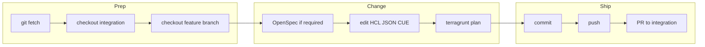

# Infra change workflow — branch, commit, PR

Use this skill whenever the task **changes the IaC repo** (not only local experiments). Align with **`AGENTS.md`** in the checkout (OpenSpec, plan-only, PR **`OpenSpec:`** line when required).

If the user is **already** on the long-lived branch that should receive the merge (e.g. **`dev-new-kuberly`**) and wants every agent change to go through a **feature branch + PR back into that same branch**, use **`current-branch-feature-pr`** first to capture **`MERGE_BASE`** and the required PR diagrams, then return here for OpenSpec, plan excerpts, and ticket steps.

## 1. Pick the integration (env) branch

**Base branch** = where the change will merge (per-environment long-lived branch). Common names — **your fork may differ**; run **`git branch -a`** and follow team docs if unsure.

| Environment | Typical branch names (pick what exists) |
|-------------|------------------------------------------|
| **Development** | `dev`, `develop`, `development` |
| **Staging** | `stage`, `staging`, `stg` |
| **Production** | `prod`, `production`, `main` (some orgs use **`main`** only for prod) |

**Rules**

- **`git fetch origin`**, **`git checkout <integration-branch>`**, **`git pull --ff-only`** so the feature branch starts fresh.
- If the ticket names the target env, use that row’s branch; if ambiguous, **ask once** which integration branch is canonical.

## 2. Create a working branch

```bash
git checkout <integration-branch>
git pull --ff-only
git checkout -b <type>/<short-slug>
```

Examples: **`feat/vpc-flow-log-retention`**, **`fix/eks-nodegroup-tag`**, **`chore/pre-commit-autofix`**.

Use a **kebab-case** slug; include ticket id if your org requires it (e.g. **`feat/KUB-123-vpc-flow-logs`**).

## 3. OpenSpec (when in scope)

For edits under **`clouds/`**, **`components/`**, **`applications/`**, **`cue/`**, or behavioral **`*.hcl`**: follow **`openspec/UPSTREAM_AND_FORKS.md`** — propose early, implement, **archive before push** if that is your team’s default (**`AGENTS.md`**). PR body must include **`OpenSpec:`** with the change path. Maintain **`openspec/changes/<name>/CHANGELOG.md`** per **`openspec-changelog-audit`** (audit + multi-repo aggregation).

Skip only for typos-only or explicit team exception.

## 4. Implement and verify locally

- **`pre-commit`** — follow **`pre-commit-infra-mandatory`** (install **`.githooks`**, run hooks, **`git add`** after auto-fixes, commit again until green).
- **`terragrunt run plan`** (and **`validate`**) where applicable — **agents: plan-only** unless a human ordered apply. Capture a **short fenced excerpt** of the plan for the PR (not the whole log).

## 5. Commit and push

```bash
git status
git add -p   # or paths you touched
git commit -m "feat(module): concise imperative subject

Optional body: why; ticket link."
git push -u origin HEAD
```

Follow **Conventional Commits** if the repo does; match existing history.

## 6. Open pull request **into** the integration branch

**Base:** the same **integration branch** you branched from (**not** a random default). **Compare:** your feature branch.

### PR title

Imperative, scoped: **`feat(eks): add node group label for cost allocation`**

### PR body template (copy and fill)

Use complete sentences. Include a **Mermaid** diagram when the change touches **data/control flow** (dependencies, IAM hops, rollout order) — skip decorative-only charts. For headings aligned with org defaults, open skill **`git-pr-templates`** (`references/infra-fork-pr.md`).

**Sections to include**

1. **Problem** — what is broken or missing today.
2. **Solution** — what this PR changes (modules, components, OpenSpec).
3. **OpenSpec** — line: **`OpenSpec: openspec/changes/archive/YYYY-MM-DD-<name>/`** (or active path per team policy); omit section only if the change is explicitly out of scope for OpenSpec.
4. **Changelog (OpenSpec)** — short excerpt from **`CHANGELOG.md`** in that change folder (**`## Summary`** + **Risk** if notable); required for in-scope work — see **`openspec-changelog-audit`**.
5. **Testing** — `pre-commit` commands run; **`terragrunt run plan`** modules + one **fenced** plan excerpt (not the entire log).
6. **Risks** — blast radius, rollback, manual steps / customer comms.

**Example Mermaid** (replace subgraphs with your real flow — GitHub/GitLab/Bitbucket render this in PR markdown):



### Mermaid constraints (for reliable rendering)

- No **spaces** in node IDs — use **`camelCase`** or **`underscores`**.
- Wrap node labels with special characters in **double quotes**.
- Avoid **`end`** as a node id.

## 7. After PR

- Link PR on **Linear/Jira**; paste **plan** permalink or key excerpt in the ticket.
- Do **not** merge unless the user asked; wait for review.

## Customer forks

If **`AGENTS.md`** points maintainer-only paths at **`~/.cursor/`**, keep **org-specific** process notes there; this skill stays **generic**.
