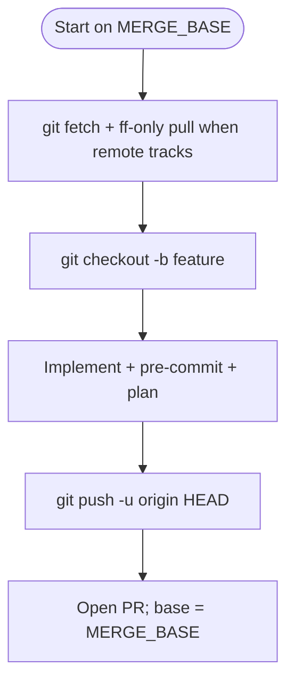

# Infra change workflow — branch, commit, PR

Use whenever the task **changes the IaC repo** (not local experiments). Align with **`AGENTS.md`** in the checkout (OpenSpec, plan-only, PR **`OpenSpec:`** line when required).

**Hard rule for agents:** do not modify files until you have decided the merge base and created the feature branch (Steps 0–1). If you already edited on a long-lived branch by mistake, **`git stash`**, branch, then re-apply — never leave the only copy of work committed only on an integration branch when a PR is expected.

## 0. Decide the merge base

Two paths — pick one before touching files:

| Situation | Path |
|-----------|------|
| You need to discover the canonical integration branch (`dev`, `stage`, `prod`) | **A — integration branch** |
| You're **already** on a long-lived branch and the team's flow is "branch off **current**, PR back to **same**" | **B — current branch** |

If unsure: **ask once** which branch should receive the merge.

### Path A — integration branch

**Base** = a per-environment long-lived branch. Common names — your fork may differ; run `git branch -a`.

| Environment | Typical branch names |
|-------------|----------------------|
| Development | `dev`, `develop`, `development` |
| Staging | `stage`, `staging`, `stg` |
| Production | `prod`, `production`, `main` |

```bash
git fetch origin
git checkout <integration-branch>
git pull --ff-only
MERGE_BASE="<integration-branch>"
```

### Path B — current branch (already on the merge target)

```bash
git fetch origin
MERGE_BASE="$(git branch --show-current)"
# Empty / detached HEAD → stop and ask which branch is the intended PR target.
[[ -n "$MERGE_BASE" ]] || { echo "no current branch"; exit 1; }
# Fast-forward only when origin tracks it.
if git show-ref --verify --quiet "refs/remotes/origin/${MERGE_BASE}"; then
  git pull --ff-only origin "${MERGE_BASE}"
fi
```

If `git pull --ff-only` fails (diverged), **stop** — do not rebase a long-lived integration branch unless explicitly asked.

## 1. Create the feature branch

```bash
git checkout -b "<type>/<slug>"
```

Use **kebab-case**; include a ticket id if your org requires it.

| Path | Naming convention |
|------|-------------------|
| **A** (integration base) | `feat/vpc-flow-log-retention`, `fix/eks-nodegroup-tag`, `feat/KUB-123-vpc-flow-logs` |
| **B** (current base) | Encode the base in the slug so reviewers see it: `feat/${MERGE_BASE}-pre-commit-order`, or `<author>/<TICKET>-<slug>` if your team uses author/ticket prefixes |

## 2. OpenSpec (when in scope)

For edits under `clouds/`, `components/`, `applications/`, `cue/`, or behavioral `*.hcl`: follow `openspec/UPSTREAM_AND_FORKS.md` — propose early, implement, **archive before push** if that is your team's default (`AGENTS.md`). PR body must include `OpenSpec:` with the change path. Maintain `openspec/changes/<name>/CHANGELOG.md` per **`openspec-changelog-audit`**.

Skip only for typos-only or explicit team exception.

## 3. Implement and verify locally

- **`pre-commit`** — follow **`pre-commit-infra-mandatory`** (install `.githooks`, run hooks, `git add` after auto-fixes, commit again until green).
- **`terragrunt run plan`** (and `validate`) where applicable — **agents: plan-only** unless a human ordered apply. Capture a **short fenced excerpt** of the plan for the PR (not the whole log).

## 4. Commit and push

```bash
git status
git add -p   # or paths you touched
git commit -m "feat(module): concise imperative subject

Optional body: why; ticket link."
git push -u origin HEAD
```

Follow **Conventional Commits** if the repo does; match existing history.

## 5. Open the PR — base = `MERGE_BASE`

**Compare:** your feature branch. **Base:** `MERGE_BASE` exactly (Path A: integration branch you checked out; Path B: the branch that was active when the task started).

```bash
# GitHub (gh authenticated, origin is GitHub)
gh pr create --base "${MERGE_BASE}" --head "$(git branch --show-current)" \
  --title "<imperative title>" --body-file pr-body.md
```

For **Bitbucket** or other hosts: push, then open in the web UI and set **Destination** = `MERGE_BASE`.

### Title

Imperative, scoped: `feat(eks): add node group label for cost allocation`

### Body — required sections

Use complete sentences. For paste-ready headings see **`git-pr-templates`** (`references/infra-fork-pr.md`).

1. **Problem** — what's broken or missing today.
2. **Solution** — what this PR changes (modules, components, OpenSpec path).
3. **OpenSpec** — `OpenSpec: openspec/changes/...` (active or archive per team policy); omit only when explicitly out of scope.
4. **Changelog (OpenSpec)** — short excerpt from `CHANGELOG.md` in that change folder (`## Summary` + Risk if notable). Required for in-scope work — see **`openspec-changelog-audit`**.
5. **Testing** — `pre-commit` commands run; `terragrunt run plan` modules + one **fenced** plan excerpt.
6. **Risks** — blast radius, rollback, manual steps / customer comms.

## 6. Mermaid — at least the git lifecycle

Always include the **branch lifecycle** diagram so the reviewer sees the work did not land on `MERGE_BASE` directly:



Replace `MERGE_BASE` in the diagram label with the real branch name when rendering.

Add a **second** diagram only when the change touches non-trivial data/control flow (IAM hops, dependencies, rollout order). Skip decorative-only charts.

### Mermaid constraints (for reliable rendering)

- No **spaces** in node IDs — use `camelCase` or `underscores`.
- Wrap labels with special characters in double quotes.
- Avoid `end` as a node id.

## 7. After PR

- Link PR on **Linear/Jira**; paste plan permalink or key excerpt.
- Do **not** merge unless the user asked; wait for review.

## Customer forks

If `AGENTS.md` points maintainer-only paths at `~/.cursor/`, keep org-specific process notes there; this skill stays generic.
