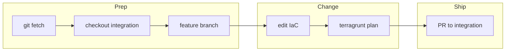

## Problem

<!-- What is broken or missing in the customer infra / fork? -->

## Solution

<!-- Modules, components, applications, OpenSpec path. -->

## OpenSpec

<!-- If required: `OpenSpec: openspec/changes/...` or archive path. -->

## Testing

- [ ] `pre-commit` (including APM sync if `apm.yml` lists deps)
- [ ] `terragrunt run plan` on: <!-- module(s) --> — summary + fenced plan excerpt

## Risks

- **Blast radius:**
- **Rollback:**
- **Out of band:**

## Flow (optional Mermaid)

<!-- Use subgraph ids without spaces; avoid `end` as a node id. See skill `infra-change-git-pr-workflow`. -->

